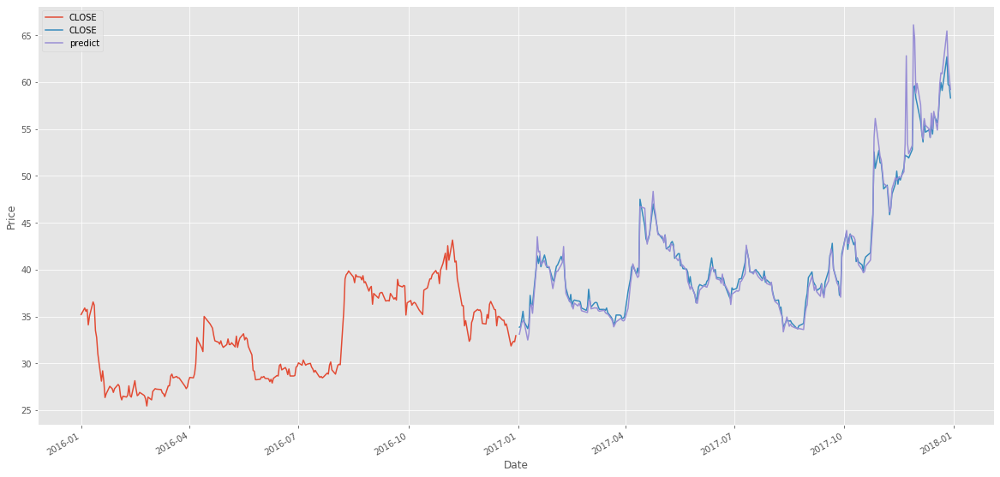

# Statistical Arbitrage Model

> Machine Learning algorithm to predict statistical arbitrage opportunities in NSE based on the 2016 data

## Introduction

For a family of stocks, generally belonging to the same sector or industry, there exists a correlation between prices of each of the stocks. However, there also exists anomalous times when for a small period of time, the correlation is broken. But the market self corrects in some time and the correlation is re-established.
During this small window of time when correlation is anomalous, there exists a money-making opportunity for quantitative traders.

## Goal

Develop a Machine Learning algorithm to predict statistical arbitrage opportunities in NSE based on the 2016 data. Test this algorithm on 2017 data.

## Methodology

 1. Pre-processing
 2. Time series analysis
 3. Classification
 4. Prediction

## Dataset

[Stock dataset](https://drive.google.com/file/d/1kyNXxSM-_MSW4kSUJ90HlPQaxPCVti5L/view)

## Libraries used

 - Pandas
 - Datetime
 - Matplotlib
 - NumPy
 - Scikit-learn
 - Mlxtend
 
## Procedure

**Selecting features and labels**

For the NSE stock exchange data,

Features are:

['OPEN', 'HIGH', 'LOW’, 'TOTTRDQTY', 'Date', 'PREVCLOSE', 'TOTTRDVAL', 'TOTALTRADES’]

And the target variable is [‘CLOSE’] 

`nse_data.csv` modified using `20Microns.py`, is stored in `20microns.csv`

`20microns.csv` consists of an extra column labelling the symbols as 0 through 494

*Note that it is also reduced in storage size* 

For *Dimensionality reduction*, we introduce a new parameter which calculates High -> low   percentage change i.e., [‘HC_PCT’] which acts as a common feature to  [‘HIGH’] and [‘LOW’]

**Data preprocessing**

*Time series analysis* is used to separate 2016 and 2017 data as training and test sets respectively.

Preprocessing is done by extracting the data from dictionaries.

**Regression**

Performed using TheilSenRegressor

***Accuracy score of the model is 96.25%***

## Plot

Graph between stock values over time, along with the predicted values in 2017

